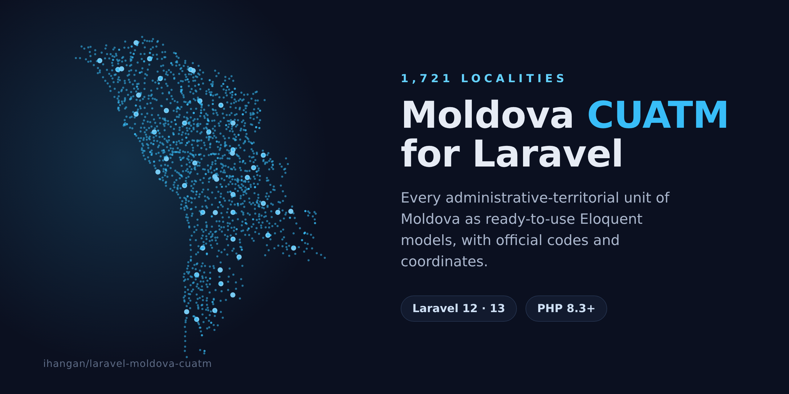

# Moldova CUATM for Laravel

[](https://packagist.org/packages/ihangan/laravel-moldova-cuatm)
[](https://github.com/ihangan/laravel-moldova-cuatm/actions/workflows/run-tests.yml)
[](https://github.com/ihangan/laravel-moldova-cuatm/actions/workflows/static.yml)
[](https://packagist.org/packages/ihangan/laravel-moldova-cuatm)
[](LICENSE.md)

Every administrative-territorial unit of the Republic of Moldova, as an Eloquent
model you can query straight away. The data comes from CUATM, the official
classifier maintained by the National Bureau of Statistics, so the codes and the
hierarchy match what government systems use.

You get the 32 districts, the municipalities, the sectors of Chișinău, every town
and all ~1,600 villages, plus Gagauzia and the Stînga Nistrului units. Each one
carries both official codes, a parent link, names in Romanian, Russian and
Ukrainian, and WGS84 coordinates.

I built this for a rental classifieds site that needed a real location tree
(region → city → sector → village) instead of a free-text address field, and
pulled it out into a package because the dataset is useful on its own.

## Requirements

- PHP 8.3 or higher
- Laravel 12 or 13

## Installation

```bash
composer require ihangan/laravel-moldova-cuatm
```

Publish and run the migration, then load the data:

```bash
php artisan vendor:publish --tag="moldova-cuatm-migrations"
php artisan migrate
php artisan cuatm:import
```

`cuatm:import` is idempotent, so you can run it again whenever a new CUATM
edition ships without ending up with duplicates.

## Usage

The model is `Ihangan\MoldovaCuatm\Models\Location`. It behaves like any other
Eloquent model.

```php
use Ihangan\MoldovaCuatm\Models\Location;
use Ihangan\MoldovaCuatm\Enums\LocationType;

// By the CUATM identifier, by the statistical code, or by slug.
Location::whereCode('0112')->first();
Location::whereStatisticCode('0111001')->first();
Location::where('slug', 'chisinau')->first();

// Every district (raion, in the classifier's own wording).
Location::ofType(LocationType::District)->get();

// Top-level units only.
Location::roots()->get();
```

### The two codes

CUATM numbers every locality twice, and the two systems are unrelated.

| Column | What it is | Example (Dobrogea) |
|---|---|---|
| `code` | *Codul unic de identificare* - 4 signs, flat, the one the classifier tells automated systems to key on | `0112` |
| `statistic_code` | *Codul statistic* - 7 digits, `RR-LLL-CC`, encodes the position in the hierarchy | `0111001` |

Băcioi makes the difference obvious: statistical code `0112000`, CUATM identifier
`5511`. Tiraspol is `9801000` and `0700`. Because the identifier carries no
structure, walk the tree with `parent` / `children` rather than by slicing codes.

### Names

Names are translatable (backed by [spatie/laravel-translatable](https://github.com/spatie/laravel-translatable)).
Romanian and English are on every locality; Russian and Ukrainian on most.

```php
$chisinau = Location::where('slug', 'chisinau')->first();

$chisinau->name;                          // current locale
$chisinau->getTranslation('name', 'ru');  // "Кишинёв"
$chisinau->getTranslation('name', 'uk');  // "Кишинів"
$chisinau->getTranslation('name', 'en');  // "Chisinau"
```

A Moldovan place name has no English translation, it has a romanisation, so the
English name is the Romanian one with the diacritics folded away: `Călărași`
is `Calarasi`, `Țînțăreni` is `Tintareni`. Where English has a real exonym it
wins instead, which is why `Stînga Nistrului` reads `Transnistria`. For the 861
names that carry no diacritics the two are the same string.

Set a fallback once (for example in a service provider) so a locale the dataset
does not carry returns Romanian instead of an empty string:

```php
use Spatie\Translatable\Facades\Translatable;

Translatable::fallback(fallbackLocale: 'ro', fallbackAny: true);
```

### Caching

The package caches nothing, deliberately.

The reads a picker actually makes are already cheap - `roots()` is about 1.5 ms
and `childrenOf()` under a millisecond - so a cache in front of them would buy
nothing and hand you an invalidation problem.

`tree()` and `ofType(LocationType::Village)` are the expensive ones, 20-40 ms,
and nearly all of that is Eloquent hydrating a thousand-odd models rather than
the query. Caching the models helps less than it looks: the serialised tree is
around 2 MB, which costs ~13 ms to read back and ~40 ms to write. Cache the
shape your view needs instead - same tree, 53 KB, 0.3 ms to read back:

```php
use Ihangan\MoldovaCuatm\Facades\Cuatm;
use Ihangan\MoldovaCuatm\Models\Location;
use Illuminate\Support\Facades\Cache;

$options = Cache::rememberForever('cuatm.picker', fn (): array => Cuatm::tree()
    ->map(fn (Location $root): array => [
        'id' => $root->id,
        'name' => $root->name,
        'children' => $root->children->map->only(['id', 'name'])->all(),
    ])
    ->all());
```

Clear the key after `cuatm:import`. CUATM changes once every few years, so
`rememberForever` is honest here.

### Type labels

`LocationType` is written in English because the code is, but nobody has to read
it that way. Every case carries a label in all four locales.

```php
use Ihangan\MoldovaCuatm\Enums\LocationType;

LocationType::District->label();      // current locale
LocationType::District->label('ro');  // "raion"
LocationType::District->label('en');  // "district"
LocationType::Town->label('ro');      // "oraș"
LocationType::Village->label('uk');   // "село"
```

Publish them if you want different wording:

```bash
php artisan vendor:publish --tag="moldova-cuatm-translations"
```

### Hierarchy

The tree is a self-referencing `parent_id`.

```php
$village = Location::where('slug', 'dobrogea')->first();

$village->parent;       // the town it belongs to
$village->ancestors();  // [town, sector, municipality], nearest first

$sector = Location::where('slug', 'botanica')->first();
$sector->children;      // towns and villages under Botanica
```

### Coordinates

```php
$location = Location::where('slug', 'chisinau')->first();

[$location->lat, $location->lng]; // 47.005..., 28.857...
```

### The query helper

`Cuatm` wraps the lookups you would otherwise write by hand. It is bound as a
singleton, so inject it wherever a constructor is available:

```php
use Ihangan\MoldovaCuatm\Cuatm;

final readonly class LocalityOptions
{
    public function __construct(private Cuatm $cuatm) {}

    public function forRegion(int $regionId): Collection
    {
        return $this->cuatm->childrenOf($regionId);
    }
}
```

A Livewire component has no constructor, so inject into `mount()`, into an
action, or into `render()`:

```php
public function render(Cuatm $cuatm): View
{
    return view('picker', ['roots' => $cuatm->roots()]);
}
```

The facade is for the places where injection would be noise, a Blade view or a
tinker session:

```php
use Ihangan\MoldovaCuatm\Facades\Cuatm;

Cuatm::findByCode('0112');             // CUATM identifier
Cuatm::findByStatisticCode('0111001'); // statistical code
Cuatm::findBySlug('chisinau');
Cuatm::roots();                        // districts, municipalities, Gagauzia, Transnistria
Cuatm::districts();
Cuatm::childrenOf($district);
Cuatm::tree();                         // roots with their children eager-loaded
```

Neither is required. Every method is a plain Eloquent query on `Location`, so
reach past the helper the moment you want something it does not cover.

### Cascading location picker

The hierarchy is not a fixed depth. A district goes straight to its villages,
while Chișinău goes municipality → sector → town → village. So the picker offers
another select for as long as the chosen unit still has children, and choosing
again higher up drops everything below it.

`roots()` and `childrenOf()` are all it needs.

```php
<?php

declare(strict_types=1);

namespace App\Livewire;

use Ihangan\MoldovaCuatm\Cuatm;
use Ihangan\MoldovaCuatm\Models\Location;
use Illuminate\Contracts\View\View;
use Illuminate\Database\Eloquent\Collection;
use Livewire\Component;

/**
 * Cascading location picker: one select per level, a new one appearing as long
 * as the chosen unit still has children.
 */
final class LocationPicker extends Component
{
    /** @var list<int> the chosen location id at each level */
    public array $path = [];

    public ?int $selected = null;

    public function mount(?int $selected = null): void
    {
        if ($selected === null) {
            return;
        }

        $location = Location::query()->find($selected);

        if (! $location instanceof Location) {
            return;
        }

        $this->path = array_map(
            static fn (Location $step): int => $step->id,
            [...array_reverse($location->ancestors()), $location],
        );
        $this->selected = $location->id;
    }

    /**
     * Choosing at a level drops every deeper level: pick another district and
     * the locality under the old one is gone.
     */
    public function choose(int $level, ?string $id): void
    {
        $this->path = array_slice($this->path, 0, $level);

        if ($id !== null && $id !== '') {
            $this->path[] = (int) $id;
        }

        $this->selected = $this->path === [] ? null : $this->path[count($this->path) - 1];

        $this->dispatch('location-selected', locationId: $this->selected);
    }

    public function render(Cuatm $cuatm): View
    {
        return view('location-picker', ['levels' => $this->levels($cuatm)]);
    }

    /**
     * Every level to show: the roots, then the children of each chosen unit,
     * stopping at the first one that has none.
     *
     * @return list<Collection<int, Location>>
     */
    private function levels(Cuatm $cuatm): array
    {
        $levels = [$cuatm->roots()];

        foreach ($this->path as $id) {
            $children = $cuatm->childrenOf($id);

            if ($children->isEmpty()) {
                break;
            }

            $levels[] = $children;
        }

        return $levels;
    }
}
```

```blade
{{-- resources/views/location-picker.blade.php --}}
<div>
    @foreach ($levels as $level => $options)
        <select wire:change="choose({{ $level }}, $event.target.value)">
            <option value="">&mdash;</option>

            @foreach ($options as $location)
                <option value="{{ $location->id }}" @selected(($path[$level] ?? null) === $location->id)>
                    {{ $location->name }} ({{ $location->type->label() }})
                </option>
            @endforeach
        </select>
    @endforeach
</div>
```

Drop it in with or without a preselected location. Passing one reopens the whole
chain down to it, so an edit form comes back with every level already chosen:

```blade
<livewire:location-picker />
<livewire:location-picker :selected="$listing->location_id" />
```

The page hears about every choice:

```php
use Livewire\Attributes\On;

#[On('location-selected')]
public function locationChosen(?int $locationId): void
{
    $this->form->location_id = $locationId;
}
```

This is not a sketch. The component above is the one in `tests/Fixtures`, bar the
namespace, and the package's suite drives it across the real dataset: from
Chișinău to Botanica to Sîngera to Dobrogea, then back up to check that choosing
again higher drops the levels below.

## Configuration

Publish the config file if you need to change the table name or the connection:

```bash
php artisan vendor:publish --tag="moldova-cuatm-config"
```

```php
return [
    'table' => 'cuatm_locations',
    'connection' => null,
];
```

The table is named `cuatm_locations` rather than `locations` so it does not
clash with one your application may already have.

## Data and updates

The dataset lives in `database/data/cuatm.json` and ships with the package.

- Both codes, the hierarchy and the Romanian names come from CUATM
  (Clasificatorul unităților administrativ-teritoriale ale Republicii Moldova),
  published by the National Bureau of Statistics - edition of 21 October 2025.
- Russian and Ukrainian names are Wikidata exonyms. The larger cities, the
  sectors of Chișinău and the special regions were checked by hand in all four
  locales; every other English name is the Romanian one romanised.
- Romanian names are normalised to the comma-below diacritics ș/ț. The
  classifier is typeset with the Turkish cedilla letters ş/ţ, which sort and
  compare differently.
- Coordinates are from public geodata.

### Taking a new edition

CUATM changes rarely. When the Bureau publishes one, upgrade the package and run
the import again:

```bash
php artisan cuatm:import
```

Rows are matched on the CUATM identifier rather than on the slug, because the
identifier is the one thing about a locality that does not change. A renamed
locality therefore keeps its id, and with it every foreign key in your own
tables; only its name and slug move. The command says what it did:

```
+-----------+------------+
|           | localities |
+-----------+------------+
| created   | 1          |
| renamed   | 1          |
| updated   | 3          |
| unchanged | 1716       |
+-----------+------------+
  renamed: bujor -> bujorul-nou (code 1234)

1 row(s) are no longer in the classifier. They were left alone, in case your own
tables point at them:
  vechi-sat (code 5678)
```

A locality the new edition dropped is reported and left in the table. Your rows
may point at it, and the package has no business deciding that for you - remove
it yourself once you have dealt with the references.

Every run rewrites the fields the dataset owns, so an edit you made to a name or
a coordinate does not survive an import. Keep changes like that in your own
table.

`--fresh` empties the table before importing, which detaches everything pointing
at a location. It asks first when it runs in production, and `--force` skips that
prompt, the same way `migrate:fresh` does.

## Testing

```bash
composer test
```

## Changelog

See [CHANGELOG.md](CHANGELOG.md) and the [releases](https://github.com/ihangan/laravel-moldova-cuatm/releases).

## Contributing

See [CONTRIBUTING.md](CONTRIBUTING.md).

## Security

Found a security issue? Email igorhangan@gmail.com instead of using the issue tracker.
See [SECURITY.md](.github/SECURITY.md).

## Credits

- [Igor Hangan](https://github.com/ihangan)
- The administrative data comes from the CUATM classifier published by the
  National Bureau of Statistics of Moldova, with Russian and Ukrainian names from
  Wikidata.

## License

The MIT License. See [LICENSE.md](LICENSE.md).

The administrative data is public information from the National Bureau of
Statistics of Moldova; Wikidata content is CC0.
